# 需要下载的软件

r8s是用于进化树订年的重要软件。然而作者Mike Sanderson只提供了MacOS的可执行程序，对于Windows用户，将r8s从源文件编译为.exe可执行文件，很多人不一定熟悉。这里介绍用Cygwin将r8s源代码编译为r8s.exe的方法。用Cygwin编译r8s软件，之前在Windows XP系统中，我在科学网博客上有介绍过，但是当时生成的r8s.exe在Windows10中已经不能运行。在Win10中，相应的操作也发生了一些变化，因此这里重新撰写了指南。

本说明是为Window10专业版，64位操作系统而写的。要编译和运行r8s，需要用到的软件包括：

1. r8s源代码: https://sourceforge.net/projects/r8s/ 

2. Cygwin: https://www.cygwin.com/install.html 用于将r8s源代码编译为.exe文件。

3. 示例数据: AAA.nex ，这是nexus文件， 包含一棵需要订年的进化树以及若干r8s命令。

4. Notepad++: https://notepad-plus-plus.org/download/v7.5.9.html 这是一个加强版的记事本程序，用于编辑nexus文件，查看运行结果。

# 安装Cygwin

Cygwin是Windows下运行的软件，用于模拟Linux/Unix操作系统，常用于将Unix/Linux操作系统下的命令行软件编译为Windows下的可执行文件(维基百科)[https://zh.wikipedia.org/wiki/Cygwin]。由于r8s是用C和Fortran为Linux编写的， 编译时会用到gcc和make，因此需要在Cygwin安装时选取好安装这些组件。

## 64位计算机应选择setup-x86_64.exe
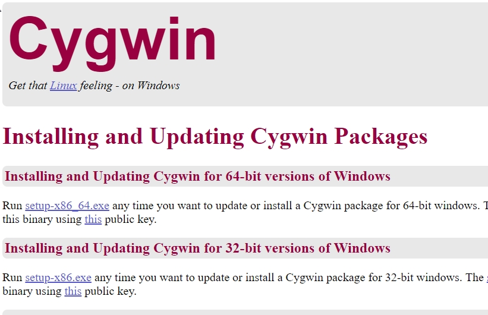

## 双击setup-x86_64.exe开始运行
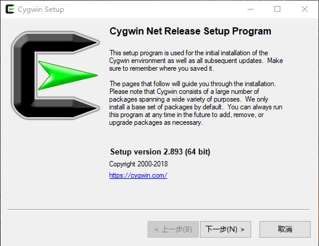

选择从网络安装即可，但是要注意选择合适的镜像，部分镜像链接可能已经过期，或者由于其他原因不能正常访问。

## 安装时注意选取安装gcc和make
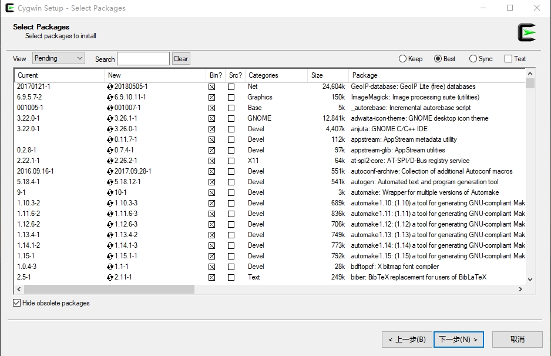

## 开始下载并安装Cygwin程序包
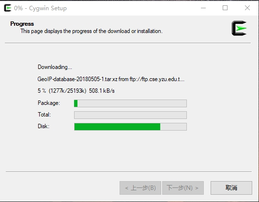

# 编译r8s

## 解压缩已经下载好的 r8s1.81.tar.gz
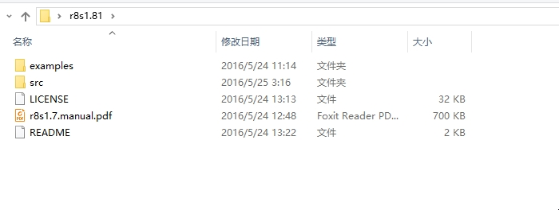

## cd到src文件夹
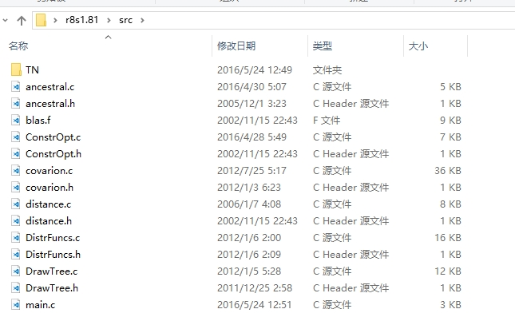

## 在Windows查找Cygwin64 Terminal
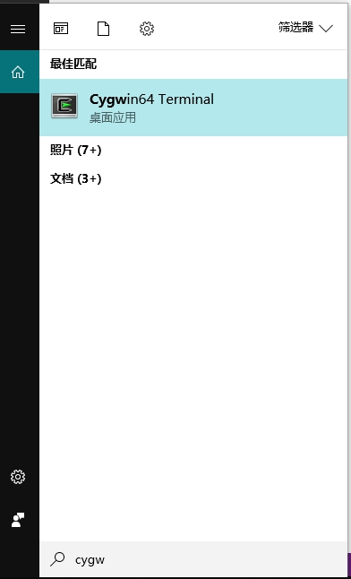

## 复制r8s/src的路径
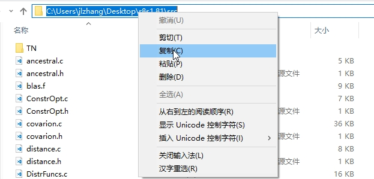

## 在Cygwin Terminal中输入r8s/src的路径，注意斜杠向右
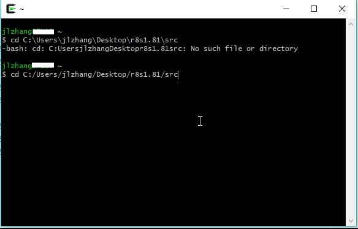

## 输入make，回车，开始编译
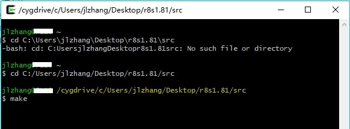

## 编译生成的r8s.exe
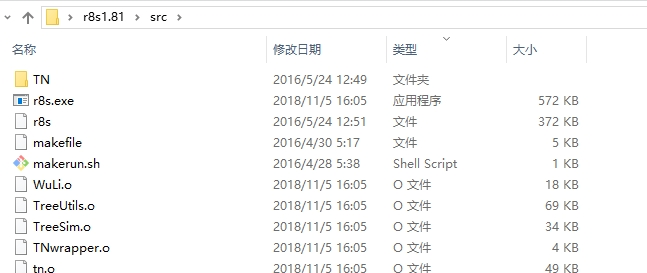

# 运行r8s
## 将r8s.exe拷贝到一个新的文件夹（如run_r8s），注意路径不能有中文
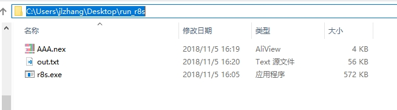

## 在Window中搜索CMD，即命令提示符Console
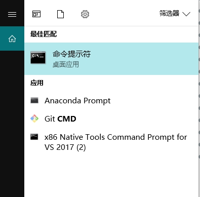

## 用cd转换到新文件夹run_r8s
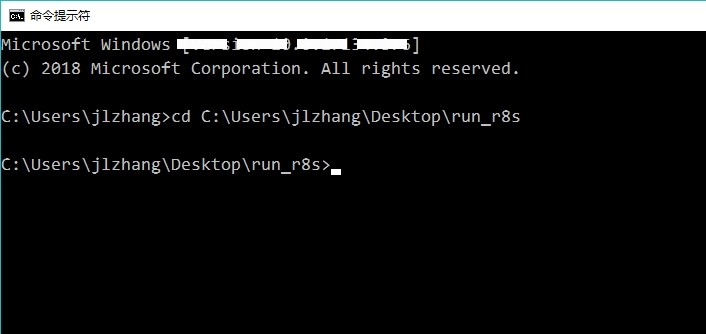

## 查看并编辑AAA.nex文件夹的r8s命令模块
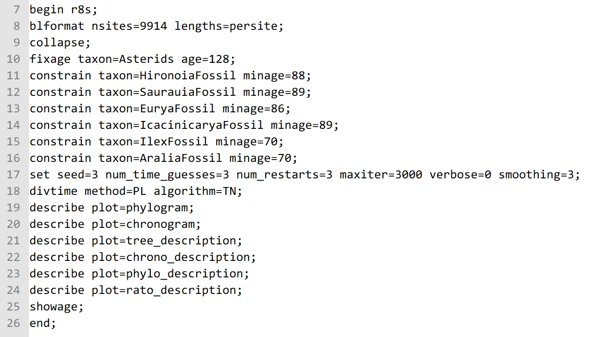
各命令的说明详见 r8s使用指南 http://blog.sciencenet.cn/upload/blog/file/2010/3/201032420201531842.0.pdf
## 运行nexus文件中的r8s命令模块
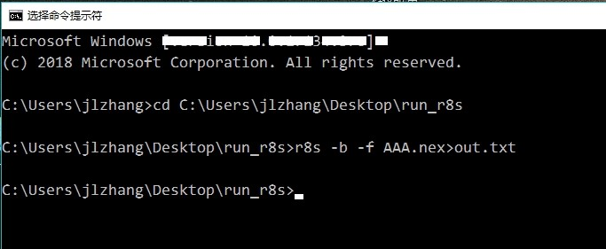

## 用Notepad++打开生成的out.txt文件
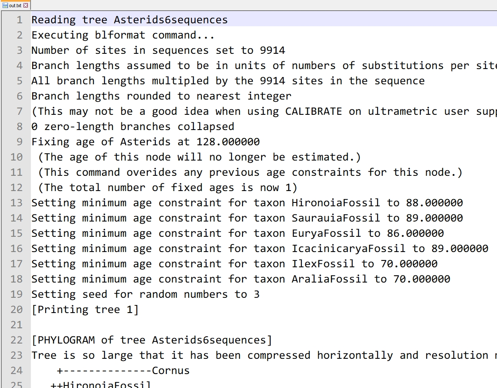
找到已经校对好分化时间的newick进化树即可。

# 参考资料
* 张金龙(2010)进化时间的估算:r8s软件使用指南 http://blog.sciencenet.cn/blog-255662-305898.html 

